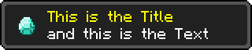
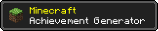
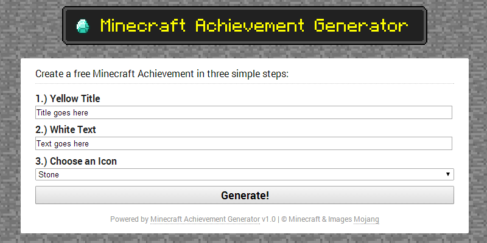
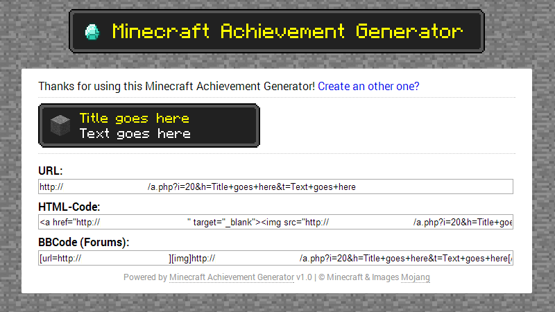

# Minecraft Achievement Generator
This is a simple, in PHP written, Generator of Minecraft Achievements for your website or blog.

## Features
* Create unique Achievements in Minecraft-style
* Many often-used icons from the game
* Simple & Responsive Design
* Copy & Paste links for websites and forums
* Download & share your personal Achievements
* Supports Google Chrome's "Web-App" feature for Android
* Simple setup
* Open-Source

## Examples & Screenshots

### Examples

### Screenshots

## Installation
The installation is very simple and you only need a webserver with PHP-support:
* Download a [ZIP archive](https://github.com/MarvinMenzerath/MinecraftAchievementGenerator/archive/master.zip) containing all the files and extract it.
* Copy every file (maybe except the `doc`-directory) to your webserver.
* Edit the `config.php`-file according to your needs and save it.
* That's it. You're done!

## License
Copyright (C) Generator 2012-2014 [Marvin Menzerath](http://menzerath.eu)  
Copyright (C) Images 2009-2014 [Mojang](https://mojang.com)

This program is free software: you can redistribute it and/or modify it under the terms of the GNU General Public License as published by the Free Software Foundation, either version 3 of the License, or any later version.

This program is distributed in the hope that it will be useful, but WITHOUT ANY WARRANTY; without even the implied warranty of MERCHANTABILITY or FITNESS FOR A PARTICULAR PURPOSE. See the [GNU General Public License](https://github.com/MarvinMenzerath/MinecraftAchievementGenerator/blob/master/LICENSE) for more details.

"Minecraft" is a trademark of Notch Development AB.
